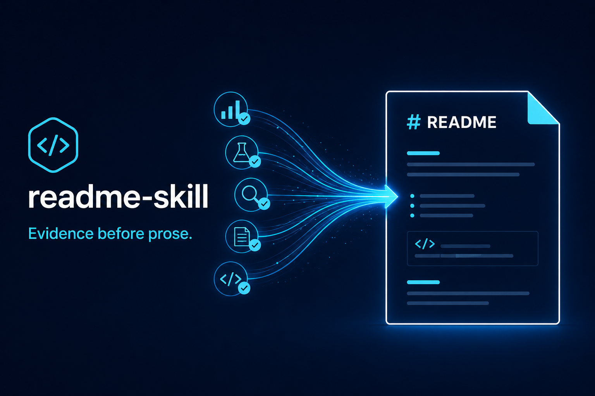

<p align="center">
  
</p>

# readme-skill

[English](./README.md) | [简体中文](./README.zh-CN.md)

[](https://github.com/ZardLi1115/readme-skill)

A Claude Code skill for creating accurate, readable GitHub README files from repository evidence and explicit user confirmation.

## ✨ Highlights

| Capability | Why it matters |
|---|---|
| ⚡ Bounded repository discovery | Reviews project structure, metadata, documentation, and configuration before drafting. |
| 🔍 Evidence-led writing | Separates verified facts, user-confirmed details, uncertain claims, and missing information. |
| 🧩 Existing README choices | Offers explicit replace, selective-reuse, or extend modes before drafting. |
| 🌐 Bilingual README support | Provides English, Simplified Chinese, and bilingual README layouts. |
| 🛡️ Safe publication rules | Avoids unsupported commands, links, compatibility claims, release details, and license statements. |
| 🧪 Quality checklist | Validates factual accuracy, executable examples, links, badges, images, diagrams, and bilingual consistency before writing. |

## 🏗️ Architecture

```text
┌──────────────────┐  request  ┌──────────────────┐
│   User request   │──────────▶│   readme-skill   │
└──────────────────┘           └──────────────────┘
                          repository facts + user choices
                                         │
                                         ▼
                               ┌──────────────────┐
                               │ Bounded discovery│
                               │ and fact ledger  │
                               └────────┬─────────┘
                                        │
                                        ▼
┌──────────────────┐  confirmed  ┌──────────────────┐
│ README.md /      │◀────────────│ Draft, checklist,│
│ README.zh-CN.md  │             │ and write gate   │
└──────────────────┘             └──────────────────┘
```

The skill scans only the files needed to support public claims, records the evidence state, asks for decisions that cannot be verified, and writes only after explicit confirmation.

## 💡 Usage Example

`readme-skill` was used to document [Long Horizon Pi Extension](https://github.com/ZardLi1115/long-horizon-pi-extension), a Pi Coding Agent extension for recoverable, section-based workflows.

The request supplied the repository URL and asked for a professional README. During discovery, the existing README was found, and the user chose a complete rewrite with an English primary README, a Simplified Chinese counterpart, verified badges, and a generated local project visual. The user declined a Star History chart.

The resulting documentation included `README.md`, `README.zh-CN.md`, and the verified local asset `assets/long-horizon-pi-extension-icon.png`. The process also found that the repository’s Pi runtime packages were declared in `devDependencies`; because Pi Git package installation uses production dependencies, the README documents the evidence-backed local checkout path instead of claiming that direct package installation is supported:

```bash
git clone https://github.com/ZardLi1115/long-horizon-pi-extension.git
cd long-horizon-pi-extension
npm install

cd /absolute/path/to/your-git-project
pi --extension /absolute/path/to/long-horizon-pi-extension/index.ts
```

The target repository’s `npm test` run passed 126 tests, `npm run typecheck` passed, and the README links, image path, license path, and Quick Start were checked before publication. Those validation results belong to the Long Horizon example repository, not to `readme-skill` itself.

## 🚀 Quick Start

1. Tell any agent: `Download this skill for me: https://github.com/ZardLi1115/readme-skill`
2. Call `readme-skill` and ask it to modify a repository README or create a new README for a named repository, for example: `Use readme-skill to update the README for <repository>, or create one for <repository>.`

## 🔄 Workflow

The skill uses a bounded documentation workflow:

1. Discover repository facts and existing documentation.
2. If a README already exists, ask whether to replace it completely, replace it while selectively retaining approved information, or extend it in place.
3. Read only the applicable README guidance, templates, and quality checks.
4. Use semantic emoji by default unless the user explicitly declines, and ask for other unverifiable public choices through explicit options where possible.
5. Ask whether to include a source-backed ASCII architecture diagram; never use Mermaid.
6. Ask whether to include a usage example. If requested, collect confirmed text, image/assets, code or commands, expected result, placement, and language.
7. Compose a complete draft with a fact ledger, an optional Architecture section, an optional Usage Example, a verified Quick Start, and explicit handling of existing README content.
8. Write README files only after the target files and changes are confirmed, then run the quality checklist against the resulting files.

When a user chooses an OpenAI image service, the skill requests the API URL and key and uses [`scripts/generate-image.py`](./scripts/generate-image.py) to create and verify a local asset without publishing credentials.

## 📦 Repository structure

| Path | Purpose |
|---|---|
| [`SKILL.md`](./SKILL.md) | Skill definition, workflow, emoji library, ASCII architecture rules, and documentation safeguards |
| [`scripts/generate-image.py`](./scripts/generate-image.py) | Generates local images through an OpenAI-compatible Images API |
| [`references/readme-structure.md`](./references/readme-structure.md) | README information architecture, emoji, architecture, and usage-example guidance |
| [`references/quality-checklist.md`](./references/quality-checklist.md) | Pre-draft and pre-write quality checks |
| [`references/badge-style.md`](./references/badge-style.md) | Evidence requirements and style guidance for badges |
| [`references/image-generation.md`](./references/image-generation.md) | Guidance for README visuals and image generation |
| [`templates/README.en.md`](./templates/README.en.md) | English README template |
| [`templates/README.zh-CN.md`](./templates/README.zh-CN.md) | Simplified Chinese README template |
| [`templates/README.bilingual.md`](./templates/README.bilingual.md) | Bilingual README layout template |

## 🎯 Design principles

- **Evidence before prose:** document only what repository files or the user support.
- **Useful before exhaustive:** help readers understand the project and reach a first useful result quickly.
- **Semantic visual language:** use the built-in emoji library by default, select symbols by meaning, and keep the layout restrained.
- **Source-backed architecture:** draw optional architecture only as aligned ASCII Art in a `text` block; Mermaid is never used.
- **Confirmed examples:** add Usage Examples only from user-supplied or verified prose, assets, code, commands, and outcomes.
- **Verified Quick Start:** every generated README keeps a verified path to a first useful result; missing evidence prompts a question instead of an invented or omitted section.
- **Safe publication:** never place API keys or other secrets in README content.
- **Consistent bilingual docs:** keep commands, paths, URLs, versions, and other technical identifiers aligned across language files.

## 📖 Documentation

Start with [`SKILL.md`](./SKILL.md) for the complete workflow. Supporting guidance and templates are available in the [`references/`](./references/) and [`templates/`](./templates/) directories.

## 📄 License

This project is licensed under the [MIT License](./LICENSE).
