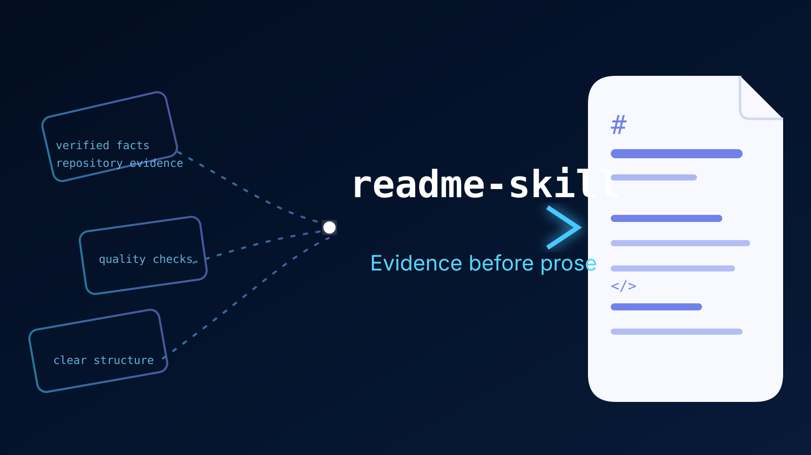

  

# readme-skill

[English](./README.md) | [简体中文](./README.zh-CN.md)

一个用于根据仓库证据和用户明确确认信息，生成准确、易读 GitHub README 的 Claude Code skill。

## 核心亮点

| 能力 | 对使用者的价值 |
|---|---|
| 有边界的仓库发现 | 在写作前检查项目结构、元数据、文档和配置。 |
| 事实驱动的写作 | 区分已验证信息、用户确认信息、不确定信息和缺失信息。 |
| 双语 README 支持 | 提供英文、简体中文和中英双语 README 布局。 |
| 谨慎的公开规则 | 避免发布缺乏依据的命令、链接、兼容性声明、发布信息和许可证说明。 |
| 质量检查清单 | 在写入前检查事实准确性、可执行示例、链接、徽章、图片和双语一致性。 |

## 工作流程

该 skill 遵循有边界的文档生成流程：

1. 发现仓库事实和现有文档。
2. 只读取适用的 README 指南、模板和质量检查规则。
3. 询问语言布局，以及仓库无法验证的可选公开信息。
4. 生成完整草稿，并提供事实清单及现有 README 的处理说明。
5. 只有在目标文件和变更内容确认后，才写入 README。
6. 针对生成后的文件执行质量检查清单。

## 仓库结构

| 路径 | 用途 |
|---|---|
| [`SKILL.md`](./SKILL.md) | Skill 定义、工作流程和文档规则 |
| [`references/readme-structure.md`](./references/readme-structure.md) | README 信息架构和章节指南 |
| [`references/quality-checklist.md`](./references/quality-checklist.md) | 写作前和写入前的质量检查 |
| [`references/badge-style.md`](./references/badge-style.md) | 徽章的证据要求和样式指南 |
| [`references/image-generation.md`](./references/image-generation.md) | README 视觉元素和图片生成指南 |
| [`templates/README.en.md`](./templates/README.en.md) | 英文 README 模板 |
| [`templates/README.zh-CN.md`](./templates/README.zh-CN.md) | 简体中文 README 模板 |
| [`templates/README.bilingual.md`](./templates/README.bilingual.md) | 双语 README 布局模板 |

## 设计原则

- **先验证事实，再组织文字：** 只记录仓库文件或用户支持的信息。
- **先提供价值，再追求完整：** 帮助读者快速理解项目，并尽快获得首次可用结果。
- **明确处理不确定性：** 无法验证的信息应省略或请求确认。
- **安全地公开内容：** 不将 API 密钥或其他机密写入 README。
- **保持双语文档一致：** 两种语言文件中的命令、路径、URL、版本号和其他技术标识保持一致。

## 文档

完整的工作流程和规则请从 [`SKILL.md`](./SKILL.md) 开始阅读。补充指南和模板位于 [`references/`](./references/) 与 [`templates/`](./templates/) 目录中。

## 许可证

仓库中未发现许可证文件。
